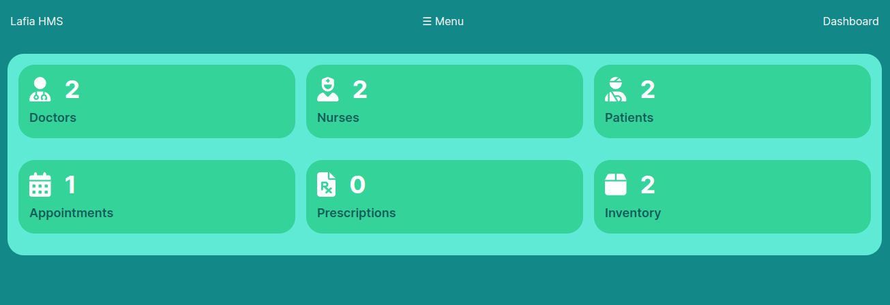
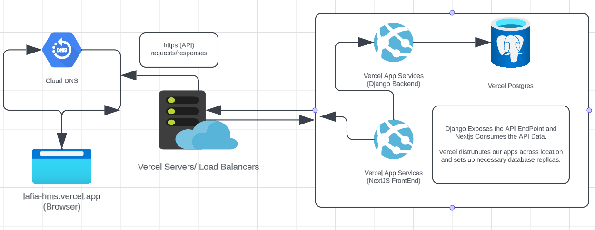

# Lafia HMS
Lafia Hospital Management System

# Introduction
Lafia HMS ([lafia-hms.vercel.app](https://lafia-hms.vercel.app/)) is a Hospital Management System.

It is aimed at solving most of the limitations attached to the traditional record-keeping system in Hospitals. As a pharmacologist, Rahmat have seen several limitations firsthand on how patients can lose their lives due to delays in doctor's appointments and care, data loss due to environmental hazards, and data mismatch. Also, Leonard and Ifeanyi has experienced the stress of standing in long queues in hospitals waiting to be attended to. So we decided to solve these limitations through Lafia HMS.

# Installation and Usage
Guideline on how to install the project:

- git clone `https://github.com/leonardnzekwe/lafia_hms.git`
- Backend (API):
- - From the project root, cd into the `api` directory
- - Run `pip install -r requirements.txt` to install the backend packages.
- - Add the database conneciton strings in the environmental variable or just use sqlite
- - Then run `python manage.py runserver` to start the local development server
- Frontend (WEB):
- - From the project root, cd into the `web` directory
- - Run `npm install` to install all the frontend dependencies
- - Add the `NEXT_PUBLIC_BACKEND_URL` environmental variable string
- - Then run `npm run dev` to start the local developement server

# Contributing Team
The Lafia HMS was built as team by:

- [Rahmat Folorunsho](https://github.com/rahma-cloud) - UI/UX/Frontend
- [Ifeanyi Akamigbo](https://github.com/valentine1244) - Frontend/Backend
- [Leonard Nzekwe](https://github.com/leonardnzekwe) - Backend/DevOps

# Technology
We strived to follow the industry best standards. So we seperated our backend logic from our front end logic. We exposed the data via API endpoints, which is consumed by the frontend through making a http request to the endpoints.

- Backend (API):
- - Language: Python
- - API Framework: Django, Django Rest Framework
- Frontend (UI):
- - Language: Typescript
- - Web Framework: Nextjs
- - Styling Framework: Tailwind CSS
- UI/UX (Design):
- - Tool: Figma
- Hosting Platforms:
- - Frontend & Backend - Vercel
- - Database - Vercel Postgres
- - Codebase - Github

# Architecture
Lafia HMS Architecture

# API Endpoints:

**Stats:**
- All Entity Stats: `GET /stats/`

**Patient:**
- List of Patients: `GET /patients/`
- Patient Details: `GET /patients/<patient_id>/`
- Create a New Patient: `POST /patients/`
- Update a Patient: `PUT /patients/<patient_id>/`
- Partially Update a Patient: `PATCH /patients/<patient_id>/`
- Delete a Patient: `DELETE /patients/<patient_id>/`

**Doctor:**
- List of Doctors: `GET /doctors/`
- Doctor Details: `GET /doctors/<doctor_id>/`
- Create a New Doctor: `POST /doctors/`
- Update a Doctor: `PUT /doctors/<doctor_id>/`
- Partially Update a Doctor: `PATCH /doctors/<doctor_id>/`
- Delete a Doctor: `DELETE /doctors/<doctor_id>/`

**Nurse:**
- List of Nurses: `GET /nurses/`
- Nurse Details: `GET /nurses/<nurse_id>/`
- Create a New Nurse: `POST /nurses/`
- Update a Nurse: `PUT /nurses/<nurse_id>/`
- Partially Update a Nurse: `PATCH /nurses/<nurse_id>/`
- Delete a Nurse: `DELETE /nurses/<nurse_id>/`

**Appointment:**
- List of Appointments: `GET /appointments/`
- Appointment Details: `GET /appointments/<appointment_id>/`
- Create a New Appointment: `POST /appointments/`
- Update an Appointment: `PUT /appointments/<appointment_id>/`
- Partially Update an Appointment: `PATCH /appointments/<appointment_id>/`
- Delete an Appointment: `DELETE /appointments/<appointment_id>/`

**Prescription:**
- List of Prescriptions: `GET /prescriptions/`
- Prescription Details: `GET /prescriptions/<prescription_id>/`
- Create a New Prescription: `POST /prescriptions/`
- Update a Prescription: `PUT /prescriptions/<prescription_id>/`
- Partially Update a Prescription: `PATCH /prescriptions/<prescription_id>/`
- Delete a Prescription: `DELETE /prescriptions/<prescription_id>/`

**Inventory:**
- List of Inventory Items: `GET /inventory/`
- Inventory Item Details: `GET /inventory/<item_id>/`
- Add an Inventory Item: `POST /inventory/`
- Update an Inventory Item: `PUT /inventory/<item_id>/`
- Partially Update an Inventory Item: `PATCH /inventory/<item_id>/`
- Remove an Inventory Item: `DELETE /inventory/<item_id>/`

# License

This project is licensed under the MIT License - see the [LICENSE](assets/LICENSE) file for details.
